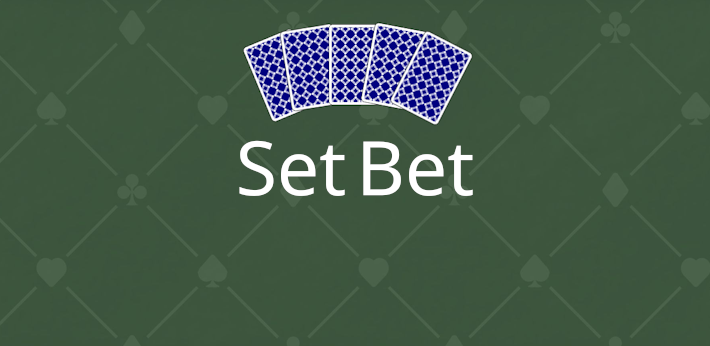

# ICS 485 Video Game Design - Team Jace: Set Bet

#### Team Members:
* Joseph Carmelo Averion
* Anson Leung
* Ciara Kang
* Eric Zhou

## Overview
<!-- ICS 485 overview or remove section entirely  -->

## Game Introduction
Set Bet is a deck-builder roguelike that takes inspiration from games like Balatro and Dicey Dungeon. The player must defeat their enemies by placing down bets that can trigger a variety of effects, like copying adjacent bets, drawing cards, and so on (aside from dealing damage). These effects are triggered if the appropriate conditions are met, the most basic one is having a stronger poker hand than the opponent. Currently, the game features an endless set of enemies with randomized bets that scale in health with each win, so see how far you can get.

## Gameplay

<!-- Add images/ art: Design and illustrations consistent with the game -->

### Battle Sequence
The turn starts with the player and opponent drawing cards out of their deck; the enemy and the player have their own 52-card deck to draw from. They will also have a hand of bets capped at a limit of 4. The enemy will play their bets before the player does, so they can have a plan accordingly. Afterwards, the enemy will play their poker hand faced down. The player will then build their poker hand to play, where they can not swap out cards in their hand like in Poker, but unused cards will remain in their hand. The poker hands are then evaluated with the bets of the opponent and the player being evaluated, and having their effects executed. If the player or opponent is not defeated, the cycle repeats, and if the 52-card deck runs out, discarded cards are reshuffled.

### Randomized Enemies
Currently, after defeating an enemy, a new enemy is generated. They will have increased health points, making them harder to defeat. A new bet deck is also generated for the enemy by randomly selecting bets out of the pool of all bets.

## Bets
The backbone of the game. Aside from having a winning or losing poker hand, there are two main parts to adding depth to bets, a bet condition and its bet effect.

### Bet Effects
The most basic effects for a card game are to deal damage, draw cards, and heal damage. Below is a list of effects currently in the game:
* Copy adjacent effect(s)
* Discard card(s)
* For each \[suit] card in hand, \[deal damage/ draw card/ heal damage]
* Damage for hand value - hand value is based on blackjack card values
* Lifesteal - deals damage and heal
* Lock card(s) - prevents a random card in their hand from being played next turn
* Redraw - discards hand and draw the same number of cards
* Steal card(s) - takes a random card from the opponent’s hand and add it to yours

### Bet Conditions
For a bet effect to activate, you must fulfill its activation condition. The base condition is to win with your poker hand, butit can also have other activation conditions for the effect to trigger. Other activation conditions include:
* Hand contains a specific suit
* Hand contains a specific rank
* Hand contains a certain poker hand

## Next Steps
1. Improved enemy AI
    * Remove hand size restrictions on enemies.
    * AI considers bets in decision-making.
    * More efficient hand creation for enemy AI.
2. Campaign mode with an end.
    * Preset enemies with set bets and artwork associated with them.
    * New environments and backgrounds.
    * Bosses with a theme and custom bets.
    * Transitions between battles.
4. Mechanic to change player bets, considered methods:
    * Shop system to purchase bets with currency.
    * End of battle reward to add a bet.
5. More types of bets
    * Bet effects (ex: copying enemy bets, adding block)
    * Bet conditions (ex: specific hand size, required health)
