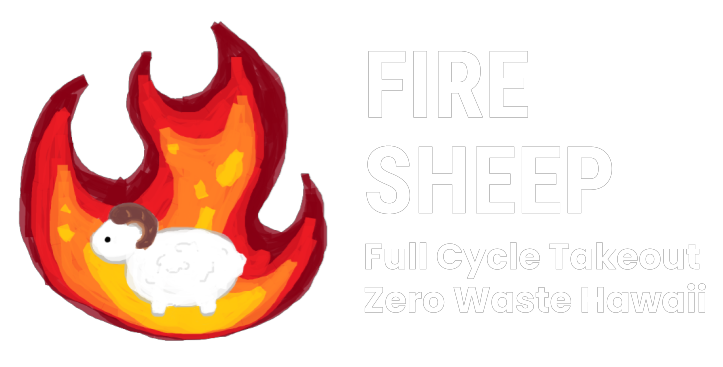

# 314 Fire Sheep - Full Cycle Takeout

[Github](https://github.com/314FireSheep/314FireSheep.github.io)
[Team Contract](https://docs.google.com/document/d/14e3PUx9-a2lmzZ4E8buuaetMcWakf2GQPMhze3hWj8s/edit?usp=sharing)
#### Members:

- Anson Leung
- Chien Hua Shu
- Samuel Yang
- Joy Tan

## Overview

Vision: A visually clean ordering page for users to easily place orders with Full Cycle Takeout.

Full Cycle Takeout - A pilot program by the non-profit Zero Waste O’ahu (Zero Waste Hawaii).

Their mission is to reduce the waste produced by single-use containers and utensils by renting out re-usable ones. Having a web application will be able to reduce the burden on both customers and the organization.

### Tech Stack

- Meteor for Javascript-based implementation of client and server code.
- React for component-based UI implementation and routing.
- React Bootstrap CSS Framework for UI design.
- MongoDB NoSQL database program for saving data generated by users.

## User Guide
Descriptions of the pages a user will be able to interact with.

### Sign-up/ -ip/ -out page
Will be in a drop-down on a navigation bar. The choices will vary based on sign-in status (signed in or not).

Sign up: User will input their desired username and password. If the username does not exist already, the account will be created and the user will be signed in.

Sign in: If a user has an account they will be able to sign in using their username and password.

Sign out: Not a page, but will give the user a confirmation that they have logged out.

### Order Page
The main page that the user will be interacting with. Users will be given a brief description of each item. As well as a method to modify the amount of containers they wish to rent out.

*Current planned design*

### Confirmation Page
Data will be transferred from order page to give the user a brief overview of their total order. Data such as total number of individual items and the fee required as collateral to rent out the items.

*Current planned design*

### History Page
Will be accessible for users that are signed in. Will display the user's orders that have yet to be resolved (where the items have yet to be registered as returned). Users will be able to see the details of their orders.

*Current planned design*

### Search Page
After inputting an Order ID, the details of that particular order will be displayed. 

*Current planned design*

## Deployment
[Fire Sheep: FCT](http://137.184.123.133)

## Community Feedback

## Developer guide

## Development History

### Milestones
[M1 Milestone project page](https://github.com/orgs/314FireSheep/projects/1)

[M2 Milestone project page](https://github.com/orgs/314FireSheep/projects/2)

