# 314 Fire Sheep - Full Cycle Takeout

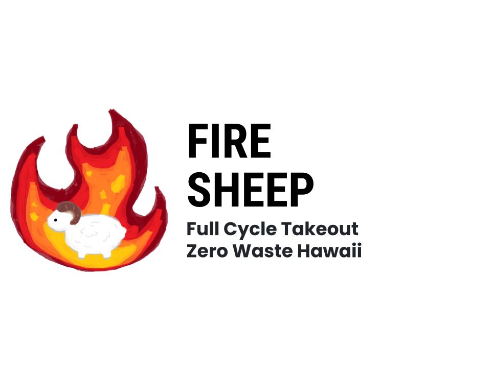

<a href="https://github.com/314FireSheep/314FireSheep.github.io" target="_blank">Fire Sheep: GitHub Pages Repository</a>

<a href="https://github.com/314FireSheep/FullCycleTakeout" target="_blank">Fire Sheep: GitHub FullCycleTakeout Repository</a>

See workflow by clicking
[](https://github.com/314firesheep/FullCycleTakeout/actions/workflows/ci.yml)

(The badge may not be displaying properly, you may see the badge in the ReadMe within the repo)

<a href="https://docs.google.com/document/d/14e3PUx9-a2lmzZ4E8buuaetMcWakf2GQPMhze3hWj8s/edit?usp=sharing" target="_blank">Fire Sheep: Team Contract</a>

#### Members:

- Anson Leung
- Chien Hua Shu
- Samuel Yang
- Joy Tan

## Table of Contents
* [Overview](#overview)
* [User Guide](#user-guide)
* [Deployment](#deployment)
* [Developer Guide](#developer-guide)
* [Development History](#development-history)

## Overview

Vision: A visually clean ordering page for users to easily place orders with Full Cycle Takeout.

Full Cycle Takeout - A pilot program by the non-profit Zero Waste O’ahu (Zero Waste Hawaii).

Their mission is to reduce the waste produced by single-use containers and utensils by renting out re-usable ones. Having a web application will be able to reduce the burden on both customers and the organization.

This applications can be modified and applied more generally for use in other places like in UH. Supporting for their own rental or loan services with different types of items.

### Tech Stack

- Meteor for Javascript-based implementation of client and server code.
- React for component-based UI implementation and routing.
- React Bootstrap CSS Framework for UI design.
- MongoDB NoSQL database program for saving data generated by users.

## User Guide
Descriptions of the pages a user will be able to interact with.

### Landing Page
Gives a brief overview of how to use the web application. Will explain how to use the site for both normal users and admins.


### Sign-up/ -in/ -out page
Will be in a drop-down on a navigation bar. The choices will vary based on sign-in status (signed in or not).

Sign up: User will input their desired username and password. If the username does not exist already, the account will be created and the user will be signed in.
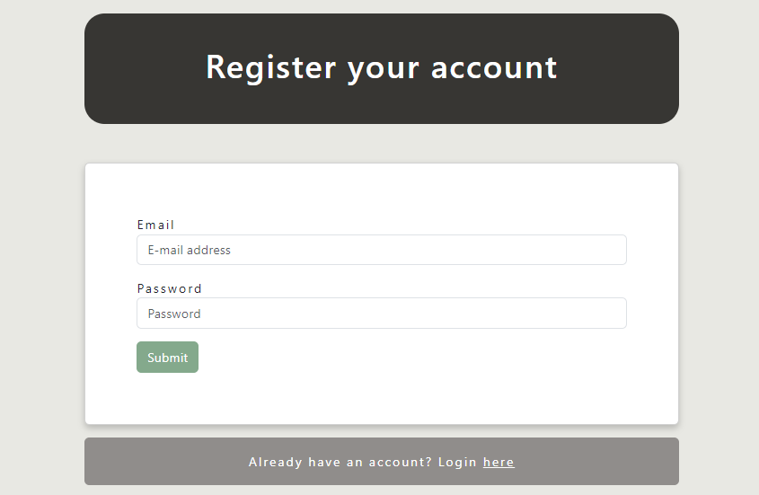

Sign in: If a user has an account they will be able to sign in using their username and password.


Sign out: After pressing  the user will receive a confirmation that they are signed out.
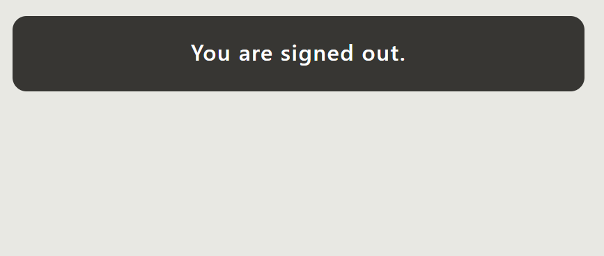

### Order Page
The main page that the user will be interacting with. Users will be given a brief description of each item. As well as a method to modify the amount of containers they wish to rent out.

After inputting their desired quantities they will click the 'Place Order' button, which takes them to the 'Confirmation Page' 

***
Milestone 1 Mockup


Milestone 2
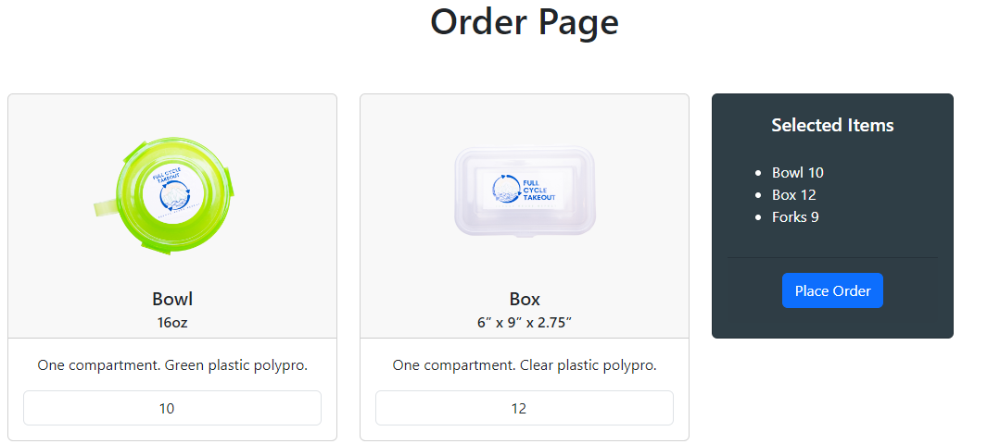

Milestone 3


***

### Confirmation Page
After pressing the place order button.
Data will be transferred from order page to give the user a brief overview of their total order. Data such as total number of individual items are shown.

At this stage is when the user will select their form of payment or collateral to rent their items.

***
Milestone 1
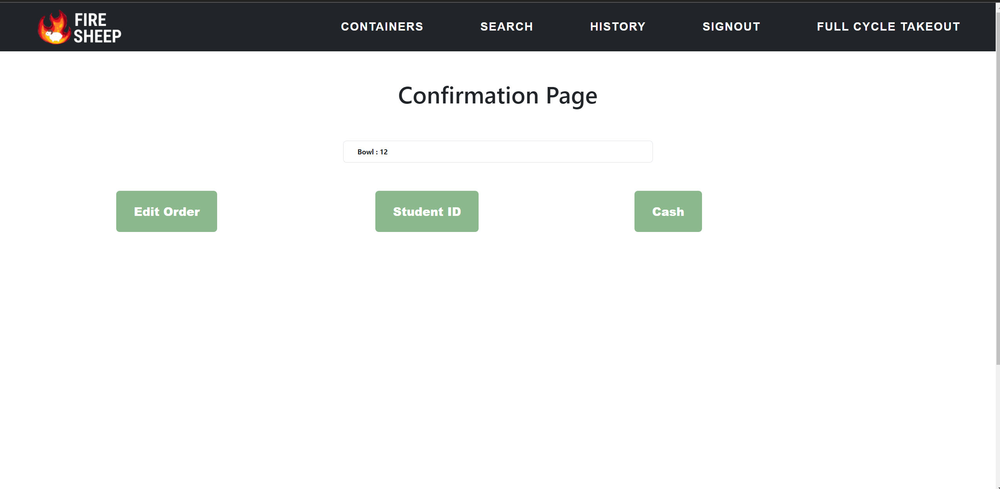

Milestone 2
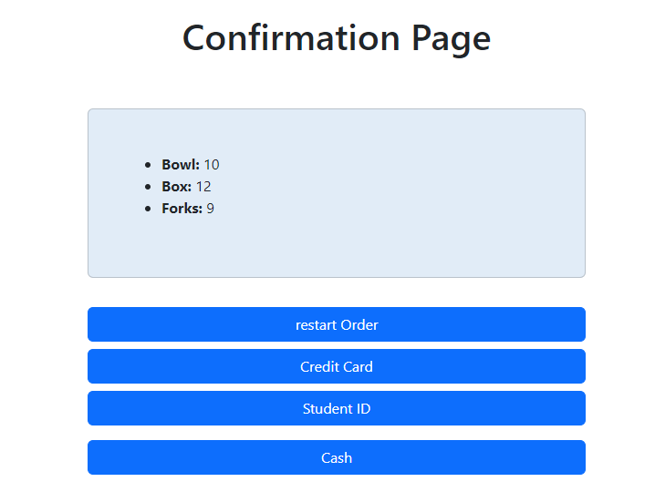

Milestone 3


***

### Result Page
After confirming their order the user will receive an Order ID and qr Code which can be shared to others to view the order.

An overview of their items will also be shown.

***
Milestone 1
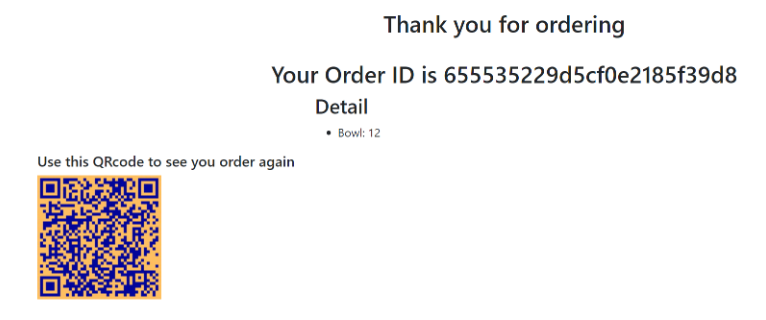

Milestone 2
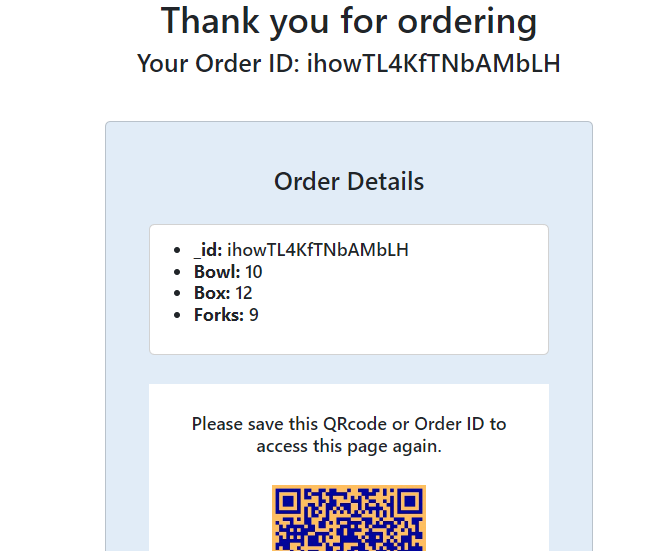

Milestone 3


***

### History Page
Will only be accessible for users that are signed in. Will display the user's previous orders, the items rented in the order, as well as their status.

Planned design

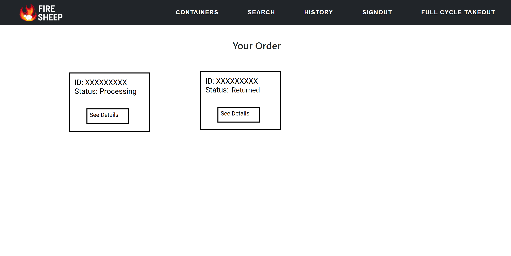

Milestone 3


### Search Page
_This page is only accessible to admin accounts._ 

Admins are able to see a list of orders in a similar fashion to the 'History Page'. By copying and pasting or typing the orderID into the search, they will be able to access the 'Return Page.' 
***
Milestone 1
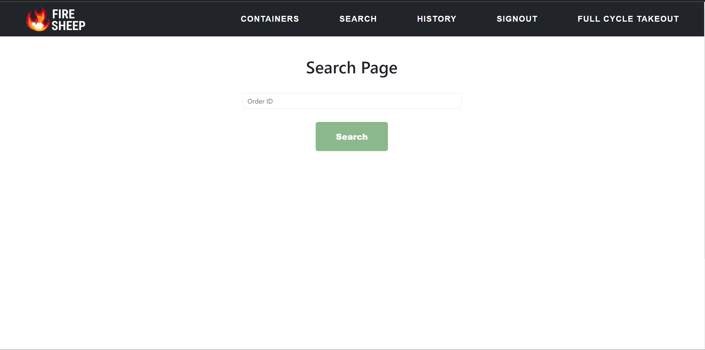

Milestone 2
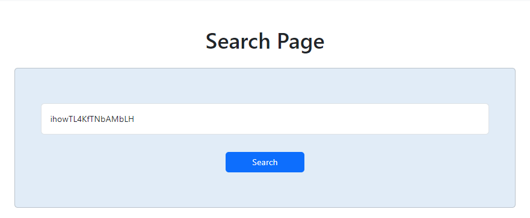

Milestone 3


***

### Return Page
_This page is only accessible to admin accounts._

Order details will be listed like the 'Result Page,' but will have access to a 'return' button. Pressing this button will change the status of the order to 'returned.' 

***
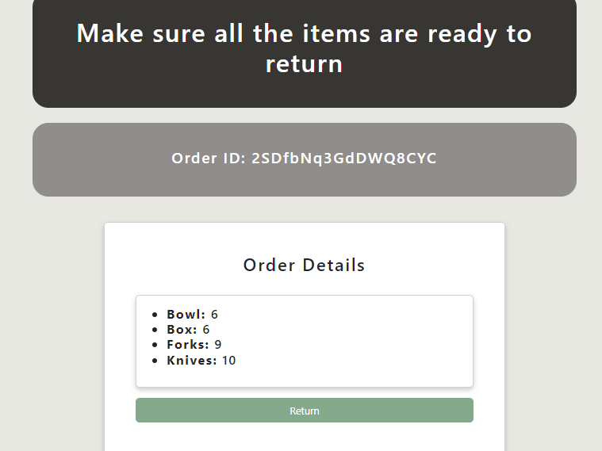

***

## Deployment
You can find our running project using the link below.
<a href="https://firesheep.me/order" target="_blank">Link to: Fire Sheep Full Cycle Takeout</a>

## Community Feedback

Please fill out this [form](https://forms.gle/wmMPXkb92VHSrshFA) to send us feedback: [you can also click here.](https://forms.gle/wmMPXkb92VHSrshFA)

## Developer guide

Step 1: [Install Meteor](https://docs.meteor.com/install.html)

Step 2: Clone [our application](https://github.com/314FireSheep/FullCycleTakeout)

Step 3: After opening the project cd into app directory.
```
$ meteor npm install
```
Step 4: Run the application using.
```
$ meteor npm run start
```
Go to http://localhost:3000 to see your project.

## Development History

Starting the project for the Hawaii Annual Code Challenge 2023, the code was developed utilizing things outside the required tech stack for the ICS 314 project. 

So using UH Bowfolios as a template, we started converting our HACC project into the required tech stack of ICS 314.

### Milestones

#### Milestone 1 Mockup and HACC
<a href="https://github.com/orgs/314FireSheep/projects/1" target="_blank">M1 Milestone project page</a>

#### Milestone 2 Meteor development
<a href="https://github.com/orgs/314FireSheep/projects/2">M2 Milestone project page</a>

#### Milestone 3 Additional features + Clean up
<a href="https://github.com/orgs/314FireSheep/projects/3">M3 Milestone project page</a>
